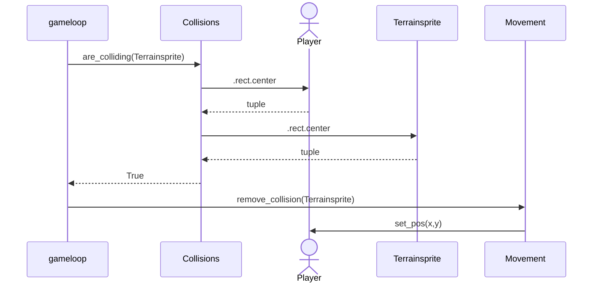

## The architecture diagram of the game.
```mermaid
 classDiagram
      class Player{
          position
          health
          hitbox
          take_damage()
          get_health()
      }
      class Movevement{
          move()
      }
      class SimpleMob{
          position
          hitbox
          health
          damage()
      }
      class Chunckloader{
          initialize_level()
          load_zone()
          get_player()
          get_pointer()
      }
      class TerrainSprite{
          position
          hitbox
          image
      }
      class GameloopHandler{
          resolution
          scale
          start_loop()
      }
      class Adventure{
          gameloop()
      }
      class 
      Adventure ..> Player
      Adventure ..> Movement
      Adventure ..> SimpleMob
      Adventure ..> Chunkloader
      Movement ..> Player
      Chunkloader ..> TerrainSprite
```

## Example logic sequence diagram: Player collision with terrainsprite
On every frame the game checks if the player is colliding with anything. If there is a collision then the game chooses what to do. In this case it runs the method remove_collision(terrainsprite) which moves the player so it just touches it.


