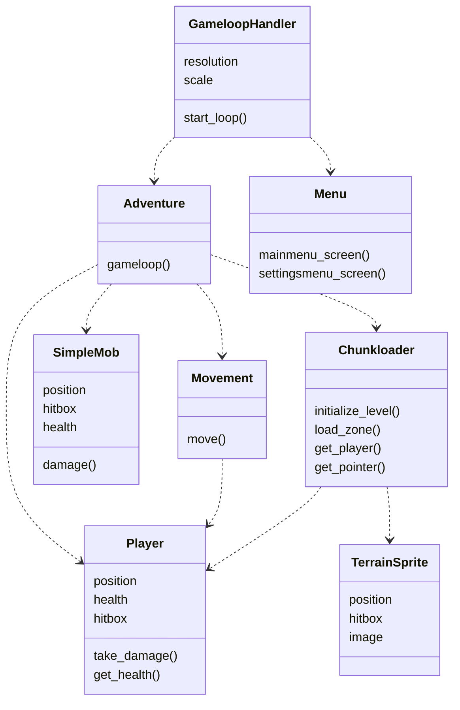
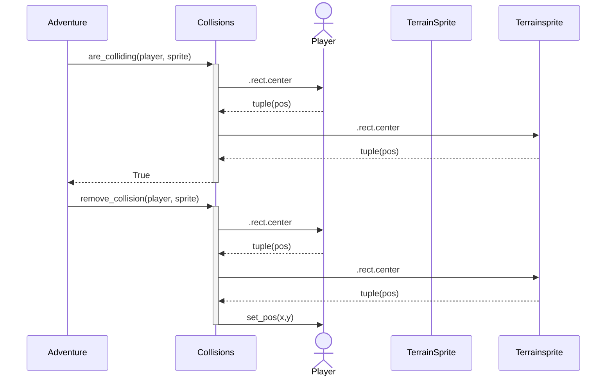

## The architecture diagram of the game.

## Example logic sequence diagram: Player collision with terrainsprite
On every frame the game checks if the player is colliding with anything. If there is a collision then the game chooses what to do. In this case it runs the method remove_collision(terrainsprite) which moves the player so it just touches it. are_colliding() and remove_collision() both check that there is a collision. are_colliding() reports this by returning True if they are colliding. remove_collision() then calculates the minimum distance to move the object to separate them.

