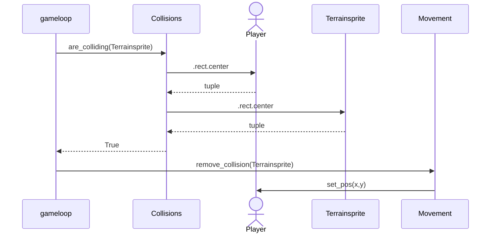

# Requirements specification
## The games idea
The game is based on the payload mission trope. You have a payload that you protect while it moves slowly towards the objective. In this game you protect your caravan on a journey through different areas varying in enemies, resources and difficulty. You could describe it as a Roguelike Payload mission.
## Users
The game is a singleplayer game with no other gamemodes or features like "god mode"
## User interface
The game has a top down 2D view with the camera following the player.
The game has a start screen with an options menu.
## Base game featureset
- start screen
  - Start button
  - Settings
- game
  - Start button jumps straight into gameplay
  - Player can start and stop the caravan movement at any moment.
  - enemies
  - Collectable resources
  - 3 areas to explore
  - 2 upgrades for the player
  - 2 upgrades for the caravan
  

## Further development ideas
- Multiple enemy types
- multiple resource types
- Platforming elements
- More upgrades for the player and the caravan
- Better graphics

## Example logic sequence diagram: Player collision with terrainsprite
On every frame the game checks if the player is colliding with anything. If there is a collision then the game chooses what to do. In this case it runs the method remove_collision(terrainsprite) which moves the player so it just touches it.

