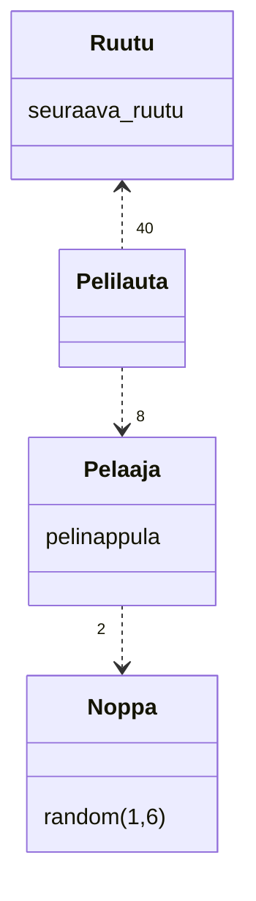
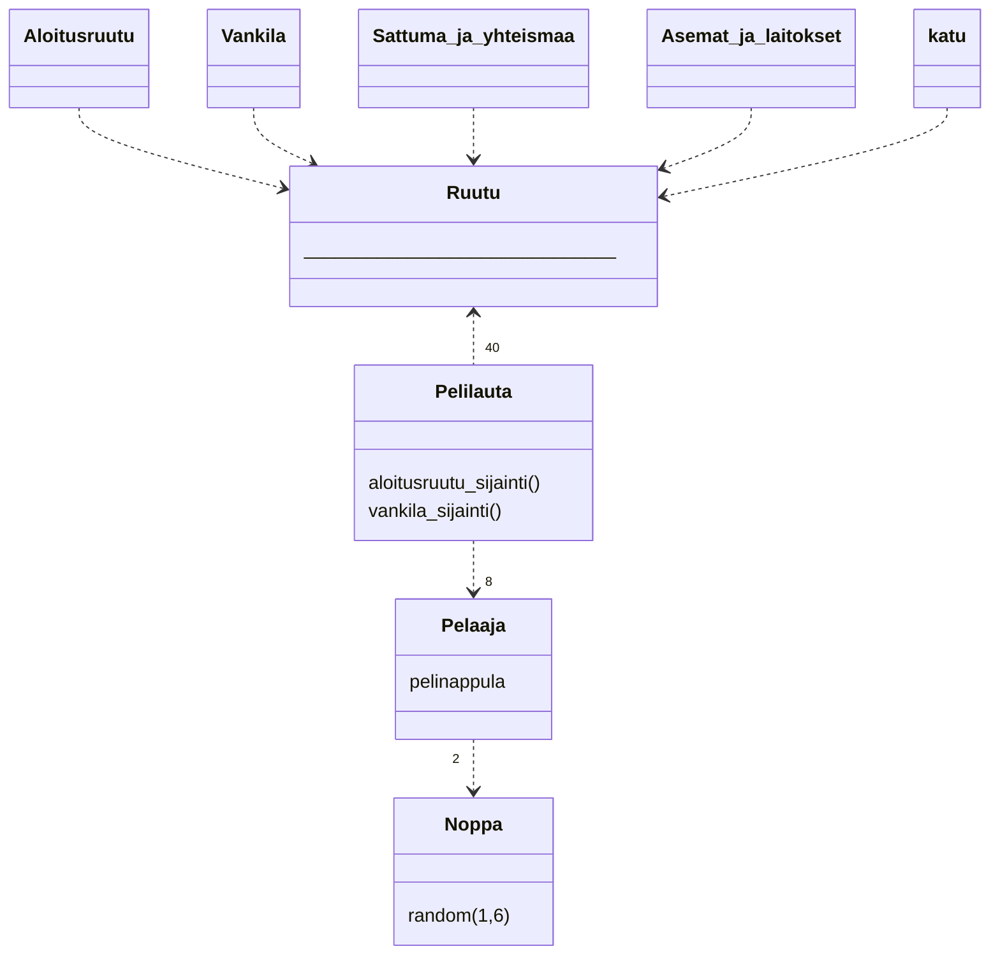

## Tehtävä 1 Monopoli

```mermaid
 classDiagram
      Pelaaja "2" ..> Noppa
      Pelilauta ..> "8" Pelaaja
      Ruutu <.. "40" Pelilauta
      
      class Ruutu{
          seuraava_ruutu
      }
      class Pelilauta{
      }
      class Pelaaja{
          pelinappula
      }
      class Noppa{
          random(1,6)
      }
```
## Tehtävä 2: Laajennettu Monopoli

```mermaid
 classDiagram
      Pelaaja "2" ..> Noppa
      Pelilauta ..> "8" Pelaaja
      Ruutu <.. "40" Pelilauta
      Aloitusruutu ..> Ruutu
      Vankila ..> Ruutu
      Sattuma_ja_yhteismaa ..> Ruutu
      Asemat_ja_laitokset ..> Ruutu
      katu ..> Ruutu
      
      class Ruutu{
          ______________________________
      }
      class Pelilauta{
          aloitusruutu_sijainti()
          vankila_sijainti()
      }
      class Pelaaja{
          pelinappula
      }
      class Noppa{
          random(1,6)
      }
```
