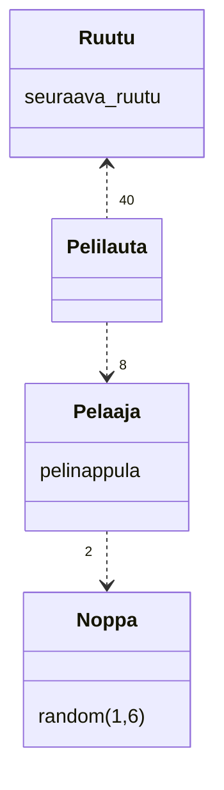

## Tehtävä 1 Monopoli

```mermaid
 classDiagram
      Pelaaja "2" ..> Noppa
      Pelilauta ..> "8" Pelaaja
      Ruutu <.. "40" Pelilauta
      
      class Ruutu{
          seuraava_ruutu
      }
      class Pelilauta{
      }
      class Pelaaja{
          pelinappula
      }
      class Noppa{
          random(1,6)
      }
```
