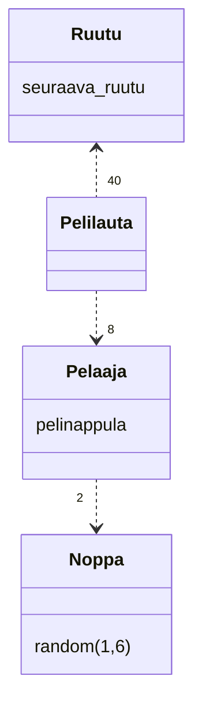
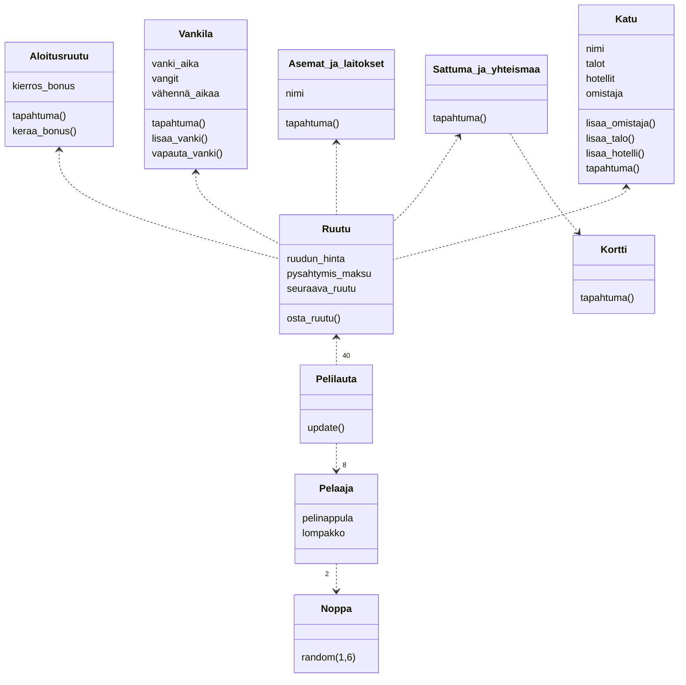
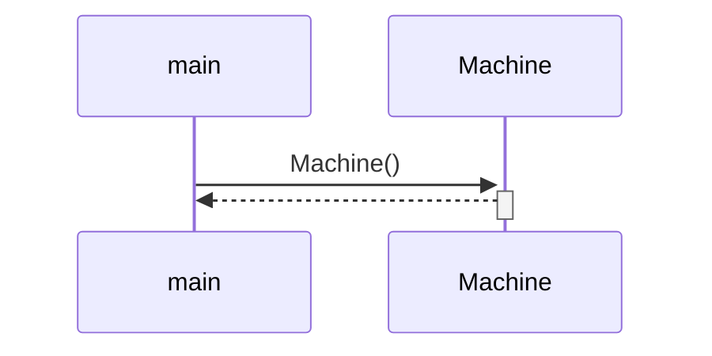

## Tehtävä 1 Monopoli

```mermaid
 classDiagram
      Pelaaja "2" ..> Noppa
      Pelilauta ..> "8" Pelaaja
      Ruutu <.. "40" Pelilauta
      
      class Ruutu{
          seuraava_ruutu
      }
      class Pelilauta{
      }
      class Pelaaja{
          pelinappula
      }
      class Noppa{
          random(1,6)
      }
```
## Tehtävä 2: Laajennettu Monopoli

```mermaid
 classDiagram
      Pelaaja "2" ..> Noppa
      Pelilauta ..> "8" Pelaaja
      
      
      Ruutu <.. "40" Pelilauta
      
      Aloitusruutu <.. Ruutu
      Vankila <.. Ruutu
      Sattuma_ja_yhteismaa <.. Ruutu
      Asemat_ja_laitokset <.. Ruutu
      Katu <.. Ruutu
      
      Sattuma_ja_yhteismaa ..> Kortti
      
      class Aloitusruutu{
          tapahtuma()
          kierros_bonus
          keraa_bonus()
      }
      class Vankila{
          tapahtuma()
          vanki_aika
          vangit
          lisaa_vanki()
          vapauta_vanki()
          vähennä_aikaa
      }
      class Sattuma_ja_yhteismaa{
          tapahtuma()
      }
      class Asemat_ja_laitokset{
          nimi
          tapahtuma()
      }
      
      class Kortti{
          tapahtuma()
      }

      class Katu{
          nimi
          talot
          hotellit
          omistaja
          lisaa_omistaja()
          lisaa_talo()
          lisaa_hotelli()
          tapahtuma()
      }
      class Ruutu{
          ruudun_hinta
          pysahtymis_maksu
          seuraava_ruutu
          osta_ruutu()
      }
      
      class Pelilauta{
          update()
      }
      class Pelaaja{
          pelinappula
          lompakko
      }
      class Noppa{
          random(1,6)
      }
```

## Tehtävä 3: Sekvenssikaavio

```mermaid
 sequenceDiagram
      main->>+Machine: Machine()
      Machine-->>-main:  
``` 
